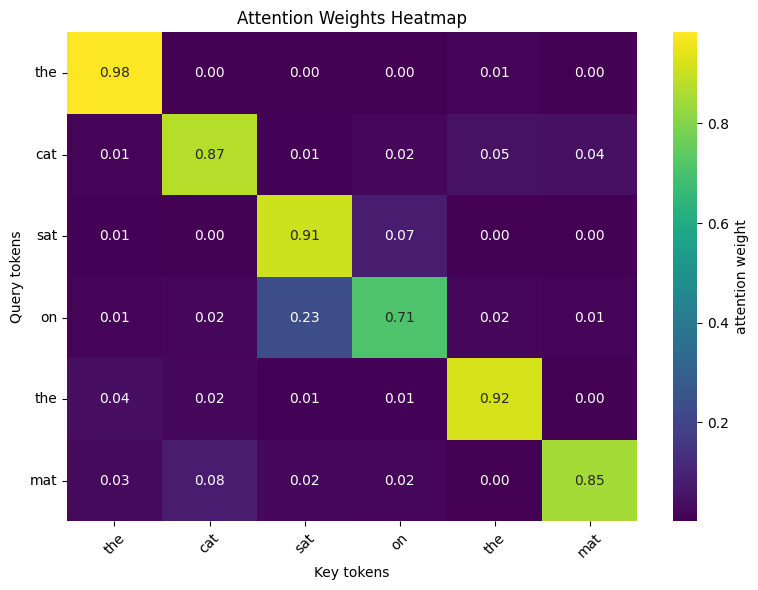
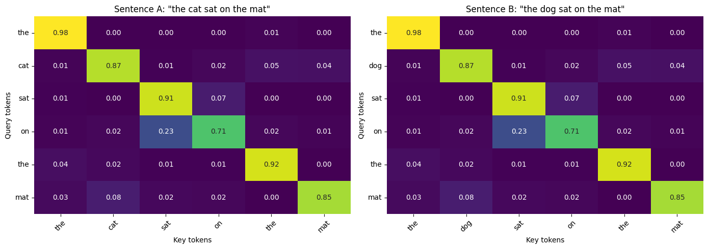
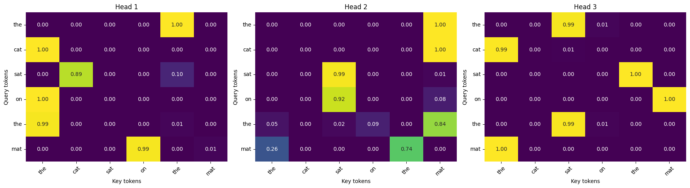

# Fine-Tuning Small LLMs for Audience-Adaptive Q&A

*QLoRA fine-tuning of decoder-only and encoder-decoder LLMs to condition answers on audience level, plus a from-scratch implementation of scaled dot-product attention.*

[](https://colab.research.google.com/github/MGhanayim/qlora-finetuning-and-attention/blob/main/From_Finetuning_to_Attention_Inside_LLMs.ipynb)
[](https://www.python.org/downloads/)
[](https://pytorch.org/)
[](https://huggingface.co/docs/transformers)
[](https://huggingface.co/docs/peft)
[](LICENSE)

**Stack:** PyTorch 2.5 · HuggingFace transformers / peft / trl / datasets · bitsandbytes (4-bit NF4) · Nebius Token Factory (Qwen3-30B teacher) · matplotlib · seaborn · pandas · Colab L4

---

## TL;DR

Fine-tuned two small open LLMs to answer the same question at three audience levels (*child*, *student*, *expert*) using **QLoRA**: 4-bit NF4 base + LoRA adapters trained on ~10 MB of weights. The decoder-only model improved cleanly; the encoder-decoder model demonstrated a real failure mode in the same recipe.

| Model | Architecture | Params | Trainable (LoRA) | Eval verdict (21 rows: yes / partial / no) | Any improvement |
|---|---|---|---|---|---|
| **SmolLM2-360M-Instruct** | decoder-only | 362M | 0.8% | **13 / 7 / 1** | **20 / 21 (95%)** |
| **flan-t5-small** | encoder-decoder | 77M | 0.9% | 0 / 5 / 16 | 5 / 21 (24%, partial only) |

Same dataset, same LoRA hyperparameters (rank 16, alpha 32, dropout 0.05, 2 epochs, seed 42). The gap isolates to architecture and scale, with one revealing finding on quantization sensitivity (see [Notable findings](#notable-findings)).

## What's in here

- **Audience-conditioned dataset**: 165 source questions filtered from `databricks/databricks-dolly-15k`, rewritten at child / student / expert level by Qwen3-30B (a strong teacher). 495 source questions × 3 levels = **1,485 training examples**, 7 × 3 = **21 held-out evaluation examples**.
- **Two QLoRA fine-tunes** under one notebook, with all training, evaluation, and analysis cells executed:
  - SmolLM2-360M-Instruct (causal LM, 4-bit NF4 + LoRA on `q/k/v/o_proj`, bf16 compute end-to-end).
  - flan-t5-small (seq2seq, bf16 LoRA on `q/v`; switched off 4-bit after diagnosing a quantization regression — see below).
- **Manual evaluation** of 84 generations (21 prompts × 2 models × {base, fine-tuned}) with side-by-side comparison and per-row judgments persisted as CSV ([data/eval_smollm2_final.csv](data/eval_smollm2_final.csv), [data/eval_flant5_final.csv](data/eval_flant5_final.csv)).
- **Trained adapters** saved in [adapters/](adapters/) (9.7 MB SmolLM2 + 4.7 MB flan-t5).
- **From-scratch scaled dot-product attention** in PyTorch with two experiments:
  - *one-word change* — demonstrates that random embeddings make token identity invisible to attention.
  - *multi-head with separate `W_Q/W_K/W_V`* — shows distinct attention patterns per head.

## Headline results

### Part 1 — QLoRA fine-tuning

Verdict counts come from manual review of every (model × test row) cell against the reference answer.

| Model | yes | partial | no | Notes |
|---|---|---|---|---|
| SmolLM2 base → FT | 13 | 7 | 1 | clear improvement on 13 / 21 rows |
| flan-t5 base → FT | 0 | 5 | 16 | no clear wins; 76% of rows worse than base |

**What fine-tuning actually changed (SmolLM2)** — drawn from side-by-side review:

- **Length compression**: FT outputs are 3-4× shorter than base. On the prime-numbers / child row, base produced 1,072 chars; FT produced 320.
- **Format-loop elimination**: most base outputs collapsed into `### Question / ### Answer` repetition; FT eliminated this.
- **Topic-drift correction**: e.g., `dee7df0b/child` base drifts entirely to "standard deviation vs variance"; FT stays on the Edgeworth box question.
- **Modest register adaptation**: Von Neumann answer length scaled with level (child=367 / student=389 / expert=575 chars); `"Mersenne primes"` appears only at expert. Child outputs were still mostly adult-register paragraphs.
- **New failure mode**: confident factual hallucinations inside coherent text (`"4 is prime"`, `"Edgeworth box is a production function"`). The base rambles; the fine-tune is confidently wrong — a harder failure to detect.

### Part 2 — scaled dot-product attention

Three reproducible experiments using 16-dim random embeddings on `"the cat sat on the mat"`:

| | Single sentence | Cat vs dog | 3-head attention |
|---|---|---|---|
| |  |  |  |
| Takeaway | Diagonal-dominant: random vectors are most similar to themselves. | **Bit-identical**: random embeddings ignore token identity; only positions matter. | Each head's distinct `W_Q/W_K/W_V` produces a visibly different attention pattern. |

## Notable findings

**flan-t5-small breaks under 4-bit quantization on this checkpoint.** Initial runs with the same NF4 recipe that worked on SmolLM2 produced gibberish loops (`"locationlocationlocationssss"`) and training loss stuck at ~18-19 (vs the random baseline `ln(32000) ≈ 10.4`). During load, `transformers` warned that `lm_head` was not tied to `shared.weight` because both were present in the checkpoint. Hypothesis: NF4 quantization broke the tied-embeddings invariant flan-t5 relies on. Tested by changing exactly one variable — loading in bf16 instead of 4-bit, all other hyperparameters fixed. Loss dropped into a normal range and outputs became coherent (though still short fragments). SmolLM2 was unaffected by the same NF4 path, so the sensitivity is specific to this checkpoint.

**LoRA rank as a regularization knob.** With `r=16` on a 1,485-example dataset, SmolLM2 already shows mild overfitting (one byte-identical-across-levels output; one fabricated `### Question / ### Answer` follow-up). `r=8` would likely be safer for this dataset size — an ablation worth running.

**Capacity, not just training, drove the SmolLM2 vs flan-t5 gap.** Same data, same LoRA hyperparameters (rank, alpha, dropout, epochs, seed, effective batch). The 4.7× parameter difference produced a 10-100× difference in output length and content quality. flan-t5-small didn't learn the output format at all; its longest FT output (`"A student is a professional who is a member of a government or industry."`) defined the level cue token "student" instead of the question topic.

## Repository structure

```
qlora-finetuning-and-attention/
├── README.md                                          # this file
├── SPEC.md                                            # technical spec
├── requirements.txt
├── From_Finetuning_to_Attention_Inside_LLMs.ipynb     # main notebook (executed, all outputs visible)
├── adapters/
│   ├── smollm2-lora/                                  # 9.7 MB, q/k/v/o_proj, r=16
│   └── flant5-lora/                                   # 4.7 MB, q/v, r=16
├── data/
│   ├── train.jsonl                                    # 495 questions × 3 levels = 1,485 examples
│   ├── test.jsonl                                     # 7 questions × 3 levels = 21 examples
│   ├── pilot_raw.jsonl                                # teacher LLM pilot batch (validation)
│   ├── eval_smollm2_final.csv                         # manual judgments for SmolLM2
│   └── eval_flant5_final.csv                          # manual judgments for flan-t5
└── results/
    └── attention_heatmaps/                            # Part 2 plots
```

## How to run

### Part 2 (attention) — local, CPU is enough

```bash
python3 -m venv .venv && source .venv/bin/activate
pip install -r requirements.txt
jupyter notebook From_Finetuning_to_Attention_Inside_LLMs.ipynb
```

Run cells 65 onward. Part 2 has no dependency on Part 1 setup — every Part 2 cell does its own imports.

### Part 1 (QLoRA training) — Colab (or any CUDA host)

`bitsandbytes` 4-bit has no stable macOS build. The notebook is set up to run end-to-end on a free Colab T4 (or an L4 / A100 for faster training):

1. [](https://colab.research.google.com/github/MGhanayim/qlora-finetuning-and-attention/blob/main/From_Finetuning_to_Attention_Inside_LLMs.ipynb)
2. **Runtime → Change runtime type → GPU**.
3. Add Colab secrets: `GH_TOKEN` (for the private-repo bootstrap clone) and `NEBIUS_API_KEY` / `NEBIUS_BASE_URL` (only needed if regenerating the training set; cached `data/train.jsonl` is reused otherwise).
4. **Runtime → Run all**. The notebook's bootstrap cell clones cached data and adapters from this repo so training and eval don't have to redo the slow pieces.

Expected wall-clock on a free T4: ~50-60 min for SmolLM2 (bf16 compute), ~10-15 min for flan-t5. L4 cuts those to ~15-25 min and ~5 min respectively.

## License

MIT — see [LICENSE](LICENSE).
